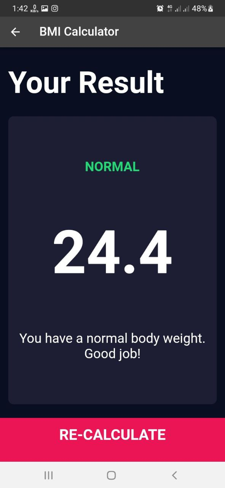

# BMI_Calculator

In this project,User can calculate their BMI.

# Contents:

* Reusable Code
* Nested Column and Row
* Some Buttons

# How to Install and Run the Project:

You can run this project:

1. Direct on Android Studio Emulator by this [link](https://github.com/RashadZA/bmi_calculator)
2. Physical Device. [Apk_link](https://drive.google.com/file/d/1rz0UmEXsPbheOBtr_T5FK6WhnE-Dd9UG/view?usp=sharing)

# How to Use the Project:

* Run this project on emulator or device.
* You will see a Home page.
* There you will insert your height, weight and age.
* When you click calculate button another page will come up.
* You will see your result.

## Sample Screenshots:

